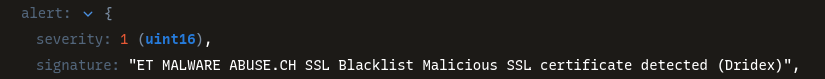

# Network Analysis - Malware Compromise

## Scenario:

A SOC Analyst at Umbrella Corporation is going through SIEM alerts and sees the alert for connections to a known malicious domain. The traffic is coming from Sara’s computer, an Accountant who receives a large volume of emails from customers daily. Looking at the email gateway logs for Sara’s mailbox there is nothing immediately suspicious, with emails coming from customers. Sara is contacted via her phone and she states a customer sent her an invoice that had a document with a macro, she opened the email and the program crashed. The SOC Team retrieved a PCAP for further analysis.

## Configure Wireshark:

First, is important to set the timezone to UTC format, to avoid any confussion during the analysis, to do that, in Wireshark I clicked `View` => `Time display format` and select `UTC Date and time of day`.

Second, I added two more columns: **Source port** and **Destination port**.

## Analysis:

To prioritize the investigation I checked the protocols in action in the packet capture, clicking on `Statistics` => `Protocol hierarchy`, this provides a high-level overview of all the communications.


Next thing to take note is the IPS involved in the converation, clicking on `Statistics` => `Conversations` => `IPv4`, this shows the conversations that the IP `10.11.27.101` had with different IPS. This is crucial for identifying which external host potentially infected the machine.


As the DNS queries are often the first step in a malware infection chain, I started analyzing the packets, the first thing I saw was a DNS query and a DNS response involving the domain `klychenoggcom`, analizing the domain in [Virustotal](https://www.virustotal.com/) the result was that 9/97 security vendors flagged the URL as malicous.


Now, focusing on the first HTTP GET request I saw this url `QIC/tewokl.php?l=spet10.spr`. Following the HTTP stream, in one of the lines of the response I saw the string `This program cannot be run in DOS mode.`, which is a sign of a portable executable like a `.exe` or `.dll`, I wrote down that.

Next, I will investigate for HTTP requests where the suspicous IP `92.181.198.231` is involved, right-clicking in the HTTP protocol => `Prepare as a Filter` => `Selected` and then right-clicking in the IP addres => `Prepare as a filter` => `...and Selected`. This sould prepare this filter `(_ws.col.protocol == "HTTP") && (ip.dst == 95.181.198.231)`.

This shows two results, the first one is the one previously selected, and the second one at `16:38:39` involves a `.rar` packet:

```sh
911	2018-11-27 16:38:39.383458	10.11.27.101	49181	95.181.198.231	80	HTTP	236	GET /oiioiashdqbwe.rar HTTP/1.1 
```

I concluded that the private IP of the infected host is `10.11.27.101` and the full URL ending in .rar from where Ursnif retrieves the follow-up malware is `http://95.181.198.231/oiioiashdqbwe.rar`.

continuing a methodic investigation of the IP address the infected host communicated with, I moved to another of the IPs listed in the conversation `176.32.33.108`, I applied this filter `ip.addr == 176.32.33.108` to check source or destiny traffic asociated with the IP.


Analyzing the traffic, in the first three packets I saw the three-way handshake (`SYN`, `SYN ACK` and `ACK`) and the fourth one is a GET request to an `/images` directory.
Following the HTTP stream, I saw the domain `cochrimato.com`, checking it in Virustotal, I found that 4 of 94 vendors flaggs this domain as malicious.


`cochrimato.com` is the domain from where the HTTP requests with GET /images/ are coming from.

Checking at the response I found some code that looked like **base64** code, but after checking it online, it didn't show anything interesting.

Malware often uses encrypted connections to hide its C2 communication from networking monitoring tools. While I can't see the content of the encrypted data without a decryption key, I can still extrat metadata. By inspecting the Client Hello packets, specifically the Server Name Indication (SNI) field, I could determine the domain the client was trying to connect to.

So, I started by checking the traffic of another of the IPs involved in the conversation `83.166.247.211`, to do that, I applied the filter `ip.addr==83.166.247.211`:


The logs show a lot of `TLS` (Transport Layer Security) traffic, which indicates that this traffic is [encrypted](https://www.cloudflare.com/learning/ssl/transport-layer-security-tls/).

I took a look to the SNI field by looking within the client `hello packet`, this tell what the domain the internal IP address is trying to access. So, I filter for `Client Hello Packets` by selecting the packet **757** which contains a `Client Hello` and a SNI field with the domain `SNI=mautergase.com`:


Accessing the packet details and expanding `Transport Layer Security` => `Handshake protocol` I found the `Handshake type: client Hello (1)`:


Right clicking on it and selecting `Prepare as a filter` => `Selected` resolved in this filter `tls.handshake.type == 1`, that showed all Client Hello traffic along with all the SNI fields which all show `SNI=mautergase.com`. Checking the domain in Virus total didn't show any interesting results, nor the IP as well.
Filtering the results by DNS (as I saw it in the protocol hierarchy) didn't show any interesting results as well.

To continue the investigation and corroborate the findings and get another perspective, I opened the `.pcap` file in [Zui](https://www.brimdata.io/download/). Zui can provide a higher-level, event-based view of the traffic.
Clicking in **Query pool** I started querying the `.pcap` typing `alert` and hitting Enter, and this is the result:


To show just the alerts, I expanded the first `alert` result, right-clicked and select `Filter == Value`, now the query looks like this `alert | event_type=="alert"`, this should list 12 rows of alerts:


Examining this alert logs, I found many of them with string realted to malware, so I can affirm that this user was infected with malware.



In this capture, I saw also that `185.244.150.230` is the Dridex post-infection traffic IP.  

Finally, I returned to Wireshark to perform a deeper static analysis. I downloaded the files by clicking on the menu `File` => `Export objects` => `HTTP` and `Save all` the malware in a **malware** folder.
Opening the **malware** folder I opened a terminal there and run `file *` and there are some interesting details about the files:


Generating a hash for the files by running `sha256sum + filename` and checking the hashes in **Virustotal**, I found that `tewokl.php%3fl=spet10.spr` was flagged as malicious by many security vendors:


I concluded that the malware binary `spet10.spr` is the one that the macro document was trying to retrieve. This final step allowed me to confirm that the downloaded files were indeed the malicious payloads.

## Conclusion:

I concluded that Sara's computer was compromised by malware. The initial infection was triggered by a macro in an email attachment, which led to a series of malicious network activities, including DNS queries to known bad domains, the download fo addiotional malware binaries and the establishment of ecrypted command-and-control communication with multiple external IP address.
